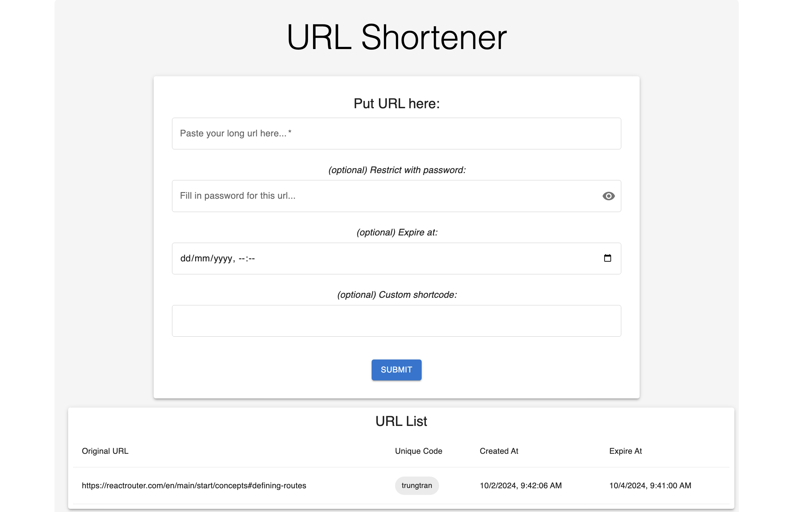

# URL Shortener

This project is a URL shortener application built with a React frontend and an Express backend. It allows users to shorten URLs, protect them with passwords

> **Important:** For demo purposes, the original URL is displayed directly on the home page. For normal usage with 'real' user, I will exclude the original URL property from the response object sent from the server to the client.

## Demo



## Live Demo

Try out the live demo of the URL Shortener Web Application [here](https://url-shortener-one-virid.vercel.app/).

## Setup Instructions

### Prerequisites

-   Node.js (v16 or higher)
-   npm or yarn

### Client Setup

1. Navigate to the `client` directory:

    ```sh
    cd client
    ```

2. Install dependencies:

    ```sh
    npm install
    # or
    yarn install
    ```

3. Create a `.env` file based on `.env.example` and configure the environment variables:

    ```sh
    cp .env.example .env
    ```

4. Start the development server:
    ```sh
    npm run dev
    # or
    yarn dev
    ```

### Server Setup

1. Navigate to the `server` directory:

    ```sh
    cd server
    ```

2. Install dependencies:

    ```sh
    npm install
    # or
    yarn install
    ```

3. Create a `.env` file based on `.env.example` and configure the environment variables:

    ```sh
    cp .env.example .env
    ```

4. Start the development server:
    ```sh
    npm run dev
    # or
    yarn dev
    ```

## Technology Choices

-   **Frontend**: React with TypeScript, Vite for bundling, and React Router for routing.
-   **Backend**: Express with TypeScript for type-safety, Mongoose for MongoDB interactions, and express-validator for request validation.
-   **Styling**: Material-UI for UI components.

## Completed Features

-   Create an API endpoint to receive long URLs and return shortened versions
-   Implement a redirect service to handle requests for shortened URLs
-   Generate unique short codes for each submitted URL
-   Allow duplicate long URLs
-   Password protection for URLs: Allow users to set a password for accessing certain
    shortened URLs
-   Custom short code: Allow users to specify their own custom short codes
-   URL Expiry Date: Enable users to set an expiration date for shortened URLs
-   Basic frontend for interacting with the API

## Known Issues or Limitations

-   _Important_: react-router is works smoothly on development, but in vercel, it won't work (i.e every route rather than root will throw not-found error), to fix this issue, we need to add a `vercel.json` file with `rewrites` property, for more detail please read [here](https://stackoverflow.com/questions/64815012/react-router-app-works-in-dev-but-not-after-vercel-deployment)
-   The frontend does not have error handling (all error handling process at the moment is base on backend)
-   The password protection feature does not support advanced hashing mechanisms.

## Ideas for Future Improvements

-   Use `react-query` to reduce repeative code when fetching resource, also for better performance
-   Implement user authentication and authorization.
-   Implement CRUD interactions for user to manage their urls
-   Add comprehensive error handling on the frontend.
-   Improve the password protection feature with hashing mechanisms.
